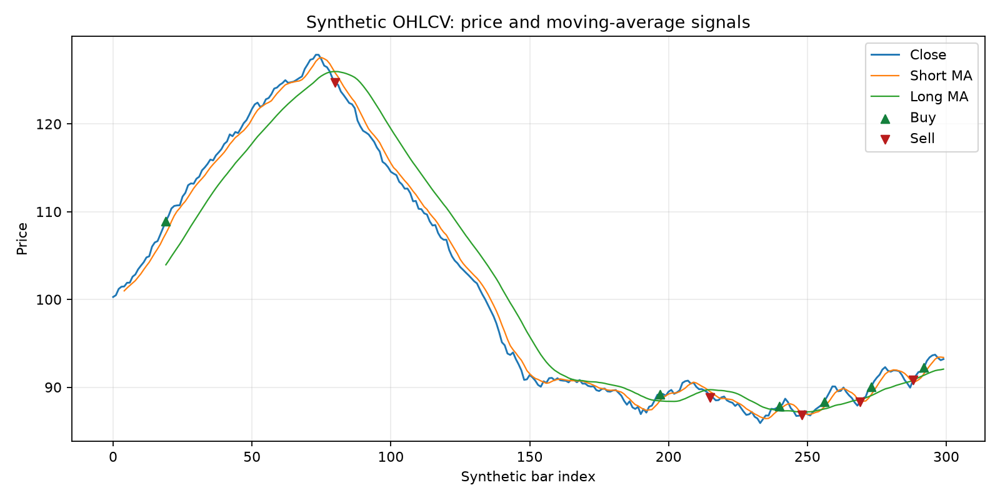
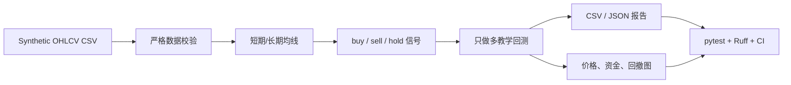
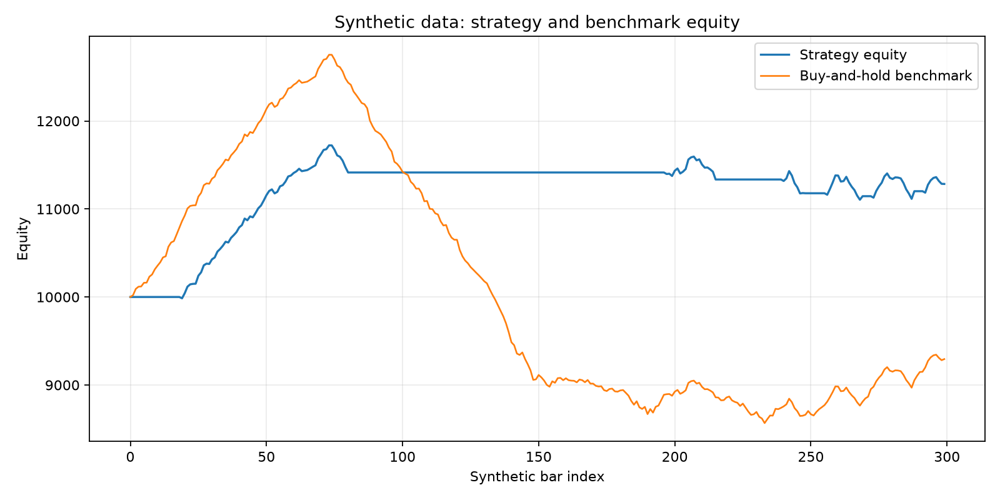
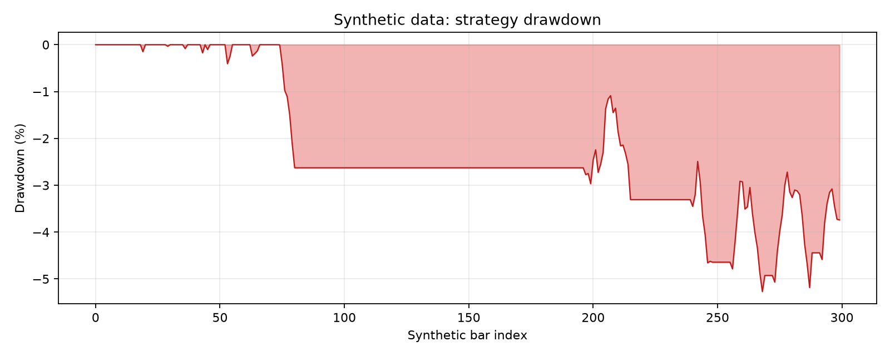

# AI Crypto Quant Research

[](https://github.com/feige666-AI/ai-crypto-quant-research/actions/workflows/ci.yml)

AI Crypto Quant Research 是一个使用 Python 构建的本地量化研究学习项目，展示从 OHLCV 数据校验、均线信号生成、基础回测到结果报告与可视化的完整基础流程。项目使用可复现的合成行情数据，不连接真实交易所。



## 项目价值

这个仓库不是盈利策略宣传，而是一个可运行、可测试、可解释的求职作品集 Demo。它重点展示：

- 使用 Python 标准库读取和严格校验 CSV。
- 把数据、策略、回测、报告和 CLI 拆成职责清楚的模块。
- 明确处理手续费、滑点、未平仓、基准和不可计算指标。
- 使用 pytest、覆盖率、Ruff 和 GitHub Actions 验证结果。
- 用文档说明设计取舍、限制和人工验证过程。

## 核心功能

- `validate`：校验文件、字段、有限数值、正价格、OHLC 关系、时间顺序和重复时间。
- `signals`：生成可配置的短期/长期简单移动平均线及 `buy`、`sell`、`hold` 信号。
- `backtest`：运行单资产、只做多、全仓进出的教学型回测。
- `demo`：一键生成信号、资金曲线、交易明细、JSON 摘要和三张 PNG 图表。
- 可复现数据：固定随机种子的 300 行 synthetic OHLCV，包含上涨、下跌和震荡阶段。
- 自动化验证：77 个测试、96% 核心包覆盖率、Ruff 和 Python 3.10–3.12 CI。

## 项目流程



## 示例图表





图中所有行情均为 synthetic data。示例结果只验证代码流程，不代表 BTC、任何代币或真实市场表现。

## 技术栈

- Python 3.10+
- 核心逻辑：`argparse`、`csv`、`dataclasses`、`json` 等标准库
- 图表：matplotlib（其底层依赖由 pip 自动安装）
- 测试：pytest、pytest-cov
- 质量检查：Ruff、`compileall`
- 自动化：GitHub Actions

## 快速开始

```bash
git clone https://github.com/feige666-AI/ai-crypto-quant-research.git
cd ai-crypto-quant-research
python -m venv .venv
python -m pip install -e ".[dev]"
python -m crypto_quant_research demo
```

安装后不需要设置 `PYTHONPATH`，也可以使用控制台命令 `crypto-quant --help`。

### Windows PowerShell

```powershell
python -m venv .venv
.\.venv\Scripts\python.exe -m pip install -e ".[dev]"
.\.venv\Scripts\python.exe -m crypto_quant_research --help
.\.venv\Scripts\python.exe -m crypto_quant_research demo
```

### macOS / Linux

```bash
python3 -m venv .venv
./.venv/bin/python -m pip install -e ".[dev]"
./.venv/bin/python -m crypto_quant_research --help
./.venv/bin/python -m crypto_quant_research demo
```

`requirements.txt` 只作为兼容入口，内容是 `-e .`；依赖版本的唯一来源是 `pyproject.toml`。

## CLI 命令

### 1. 校验数据

```bash
python -m crypto_quant_research validate --input data/sample_data.csv
```

成功输出会说明输入路径、行数、起止时间、重复时间、排序、字段、数值和 OHLC 校验结果。

### 2. 生成信号

```bash
python -m crypto_quant_research signals \
  --input data/sample_data.csv \
  --short-window 5 \
  --long-window 20 \
  --output results/signals_sample.csv
```

### 3. 运行回测

```bash
python -m crypto_quant_research backtest \
  --input data/sample_data.csv \
  --short-window 5 \
  --long-window 20 \
  --initial-cash 10000 \
  --fee-rate 0.001 \
  --slippage-rate 0.0005 \
  --equity-output results/equity_curve_sample.csv \
  --trades-output results/trades_sample.csv \
  --summary-output results/backtest_summary_sample.json
```

默认 `--close-position-at-end` 会在最后一根数据以相同滑点和手续费规则强制平仓。使用 `--no-close-position-at-end` 时，最后持仓按末价计入权益，JSON 的 `open_position` 为 `true`，且不把它计为完成交易。

### 4. 一键 Demo

```bash
python -m crypto_quant_research demo
```

## 重新生成合成数据

```bash
python scripts/generate_sample_data.py \
  --rows 300 \
  --seed 42 \
  --output data/sample_data.csv
python -m crypto_quant_research validate --input data/sample_data.csv
```

生成器使用固定种子，数据可重复；它不是历史行情，也没有为获得更好收益而调参。

## 示例输出

`demo` 生成：

- `results/signals_sample.csv`
- `results/equity_curve_sample.csv`
- `results/trades_sample.csv`
- `results/backtest_summary_sample.json`
- `docs/assets/price_and_signals.png`
- `docs/assets/equity_curve.png`
- `docs/assets/drawdown_curve.png`

当前固定样例的真实运行摘要：

| 指标 | 结果 |
|---|---:|
| 数据行数 | 300 |
| 初始资金 | 10,000.00 |
| 最终权益 | 11,284.43 |
| 总收益率 | 12.84% |
| 买入并持有收益率 | -7.06% |
| 最大回撤 | 5.27% |
| 完成交易 | 6 |
| 胜率 | 50.00% |
| Profit Factor | 5.77 |
| 累计手续费 | 133.84 |
| 市场暴露率 | 41.00% |

这组数字来自人为构造的趋势阶段和简化成交模型，不能推导出真实市场优势或未来收益。

## 主要指标

- **最终权益**：现金加按当前收盘价计算的持仓价值。
- **总收益率**：最终权益相对初始资金的变化。
- **基准收益率**：首根收盘价买入并持有到最后一根的变化。
- **最大回撤**：权益相对历史峰值的最大跌幅。
- **胜率**：盈利的完成交易数除以全部完成交易数；没有完成交易时为 `null`。
- **Profit Factor**：盈利交易净利润总和除以亏损交易净亏损绝对值；没有亏损交易时为 `null`，不伪装成 0。
- **市场暴露率**：有持仓的数据行数占全部数据行数的比例。

## 回测假设

- 当前 K 线收盘价产生信号，并在同一收盘价基础上加入滑点后成交。
- 买入价为 `close × (1 + slippage_rate)`，卖出价为 `close × (1 - slippage_rate)`。
- 手续费按买入和卖出成交金额分别计算。
- 单资产、只做多、全仓买入、全仓卖出；不做空、不使用杠杆。

这种“当前收盘信号 + 当前收盘成交”是教学简化，存在时点和执行偏差，不能直接用于真实交易。完整说明见 [docs/backtest_assumptions.md](docs/backtest_assumptions.md)。

## 项目结构

```text
.
├── .github/workflows/ci.yml
├── data/sample_data.csv
├── docs/
│   ├── assets/
│   ├── architecture.md
│   ├── backtest_assumptions.md
│   ├── baseline_audit.md
│   ├── interview_talking_points.md
│   ├── portfolio_walkthrough.md
│   └── resume_project_description.md
├── examples/usage_example.md
├── results/
├── scripts/generate_sample_data.py
├── src/crypto_quant_research/
├── tests/
├── CODEX_UPGRADE_REPORT.md
├── pyproject.toml
└── README.md
```

## 测试和质量检查

```bash
pytest -q
pytest --cov=crypto_quant_research --cov-report=term-missing
ruff check .
ruff format --check .
python -m compileall src
```

本次升级的本地验收为 77 个测试全部通过、核心包总覆盖率 96%、Ruff 和编译检查通过。GitHub Actions 在 Python 3.10、3.11、3.12 上运行相同检查。

## 我在项目中的工作

- 确定项目目标、风险边界和作品集验收标准。
- 检查输出、发现问题、提出修改要求并参与最终验证。
- 明确哪些是已实现功能，哪些只能放进后续计划。
- 整理可公开展示的最终项目。

Codex 辅助拆解任务、生成和修改代码、编写测试、排查问题和整理文档。最终结果通过实际命令、测试、覆盖率、代码检查和人工图表检查验证，不把 AI 生成等同于自动正确。

## 当前状态与后续计划

当前版本已完成本地 synthetic data 基础流程。合理的后续方向是增加更多数据质量报告、支持可选的下一根开盘价成交模型、增加性能基准和更细的测试，但仍应保持本地研究边界。

不计划把交易所 API、实盘、做空、杠杆、机器学习、数据库或 Web 平台包装成本项目当前能力。

## 已知局限

- 合成数据不能替代历史数据或样本外验证。
- 当前收盘价产生信号并成交存在同 bar 执行偏差。
- 只支持一个资产、只做多和全仓进出。
- 未模拟盘口深度、流动性、税费、停牌或订单失败。
- Profit Factor 等指标在只有少量交易时不稳定。

## 免责声明

本项目仅用于编程学习、量化研究流程演示和求职作品集展示，不构成投资建议。项目不连接真实交易所、不执行真实订单，也不承诺任何收益。
