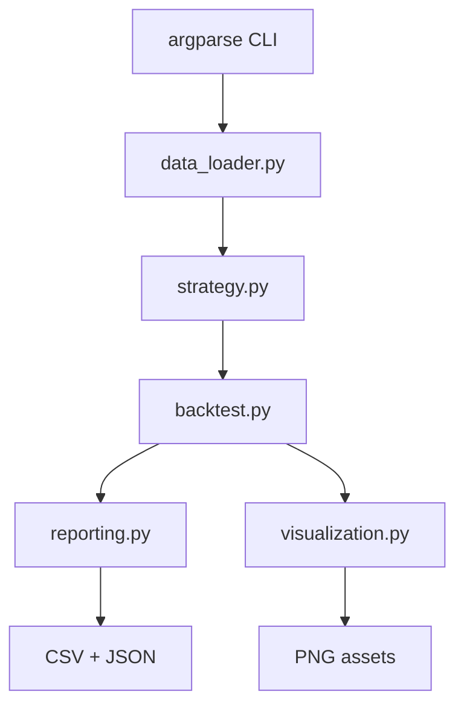

# 架构说明

## 设计目标

项目用尽量少的概念展示一条完整研究链路：本地合成数据进入严格校验，生成简单均线信号，经过只做多教学回测，最后导出可检查的表格、摘要和图表。

## 模块职责

| 模块 | 单一职责 |
|---|---|
| `data_loader.py` | 读取 CSV，并完成字段、数值、时间和 OHLC 关系校验。 |
| `strategy.py` | 计算移动平均线并生成交易意图信号，不处理资金。 |
| `backtest.py` | 根据确定规则模拟现金、持仓、费用、权益、回撤和完成交易。 |
| `reporting.py` | 把稳定字段写入 CSV 和 JSON，不改变计算结果。 |
| `visualization.py` | 把信号和回测结果绘制成 GitHub 可读图表。 |
| `cli.py` | 解析参数、编排模块、输出简洁用户提示。 |

## CLI 调用流程

- `validate`：CSV → 校验摘要。
- `signals`：CSV → 校验 → 均线 → 信号 CSV。
- `backtest`：CSV → 校验 → 均线 → 回测 → 资金/交易/摘要文件。
- `demo`：执行上述完整链路，并额外生成三张图表。

## 数据校验流程

1. 确认路径存在、是普通文件且非空。
2. 确认表头含六个必需字段。
3. 把数值字段转换为有限浮点数，拒绝 NaN 和 Infinity。
4. 检查正价格、非负成交量和 OHLC 关系。
5. 检查时间戳非空、不重复、按升序排列。
6. 策略入口再检查数据行数是否满足长均线窗口。

错误包含文件、行号、字段、错误值和原因，CLI 捕获预期异常后不打印冗长 traceback。

## 策略与回测关系

策略只输出 `buy`、`sell`、`hold`。回测负责判断当前是否持仓，因此重复 `buy` 和空仓 `sell` 会被安全忽略。均线未形成时为 `hold`；第一次形成多头关系时发出 `buy`，从非空头关系转为空头关系时发出 `sell`。

## 输出关系

- `signals_sample.csv`：观察策略在每根数据上的均线与信号。
- `equity_curve_sample.csv`：观察执行动作、现金、持仓、权益、基准和回撤。
- `trades_sample.csv`：只保存已完成交易。
- `backtest_summary_sample.json`：保存运行参数、核心指标、数据说明和假设。

## 关键设计取舍

- **单资产只做多**：减少仓位与保证金概念，让读者集中理解数据、信号和 PnL。
- **标准库优先**：CSV、计算、CLI 和报告不依赖大型数据框架；matplotlib 仅用于图表。
- **合成数据**：可公开、可重复、无账户隐私，但不代表真实市场。
- **不连接交易所**：避免密钥、资金和网络副作用，保持离线可测试。
- **稳定输出字段**：便于测试、比较和面试讲解。
